# Architecture & data-flow diagrams

Mermaid diagrams for the whole system, matching the code. Paste any block into a
Mermaid renderer (GitHub renders these natively). See `ARCHITECTURE.md` for the
prose design and `SECURITY.md` for the threat model.

---

## 1. System containers (how the pieces connect)

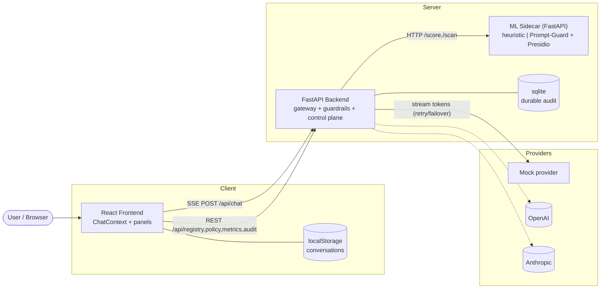

- Enforcement is entirely server-side; the client streams from the backend and
  only sanitizes output at the render boundary (LLM02).
- The ML sidecar is reached through a stable contract; real providers are opt-in
  (mock is the keyless default + last-resort fallback).

---

## 2. Chat request — end-to-end data flow

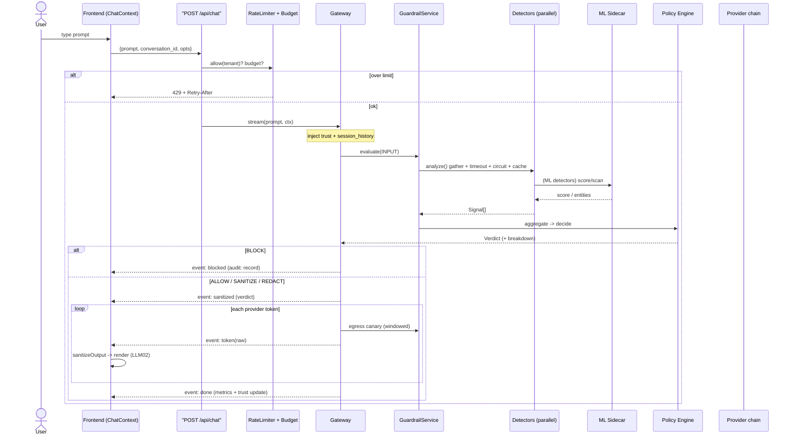

---

## 3. Guardrail pipeline — data plane vs control plane

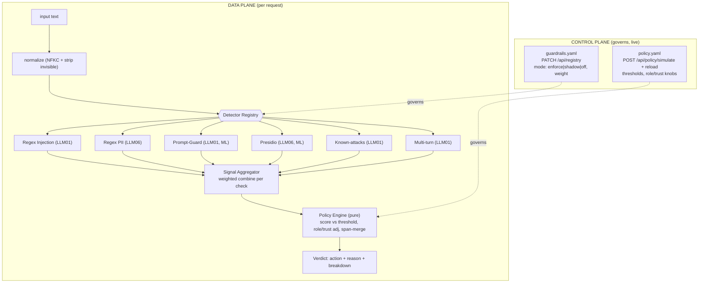

- **Detection** (detectors) → **Aggregation** (combine per check) → **Decision**
  (pure policy) are three isolated stages. Adding a detector never touches the
  policy engine — the aggregator folds it into the check's score.

---

## 4. Guardrail Service internals (resilience per detector)

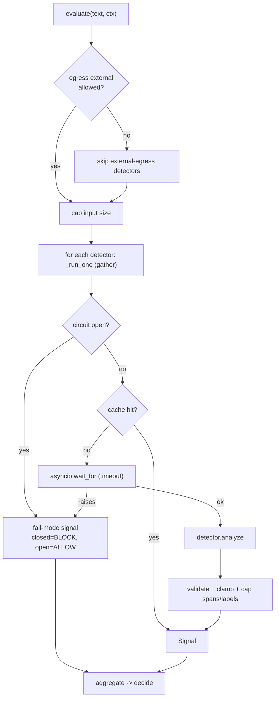

---

## 5. Provider routing — retry then failover

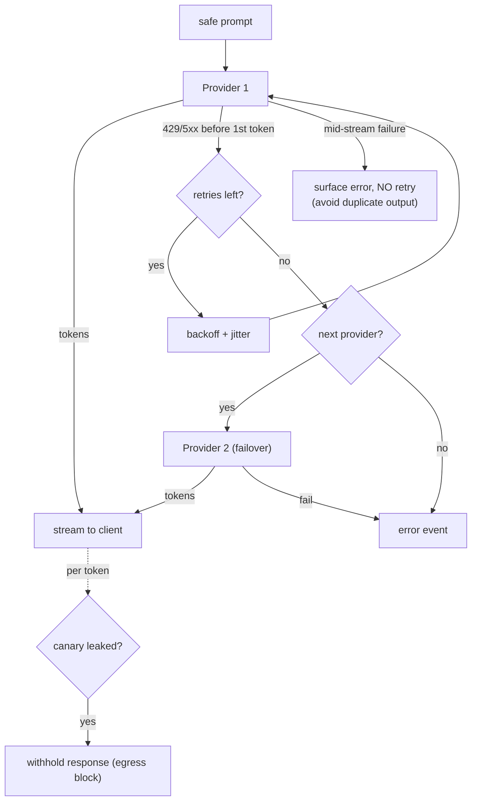

---

## 6. Control plane + shadow mode (the demo)

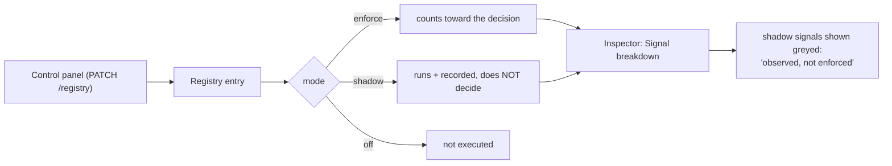

- Flip a detector to **shadow**, watch its signal appear in the breakdown without
  changing outcomes, then flip to **enforce** — same pipeline, no redeploy.

---

## 7. Observability — sync audit vs async telemetry

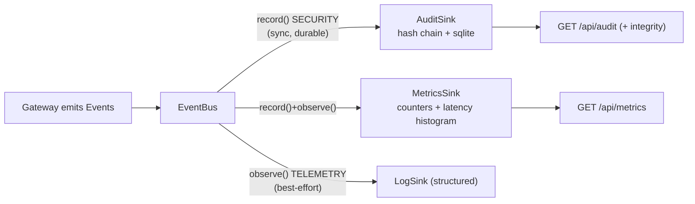

- Security decisions are audited **synchronously before responding**; metrics/logs
  are best-effort so a telemetry failure never breaks a request.

---

## 8. Multi-turn / trust session loop

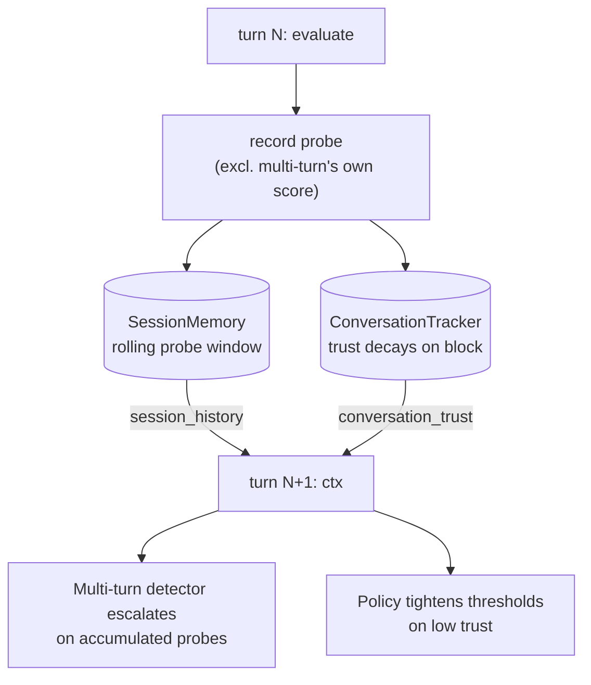

---

## 9. Backend package structure

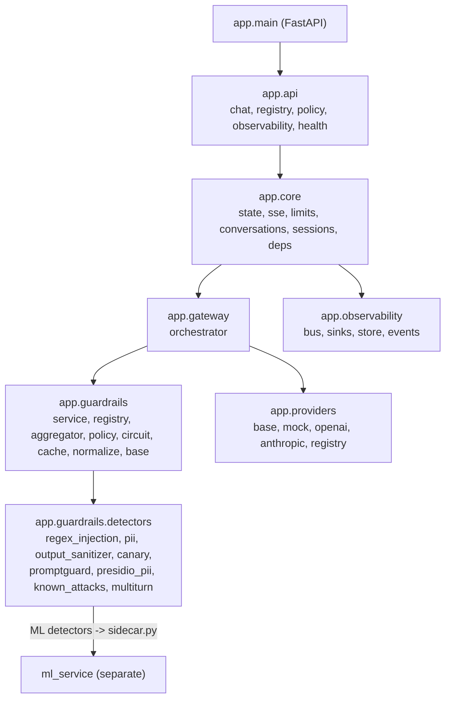

---

## 10. Frontend structure

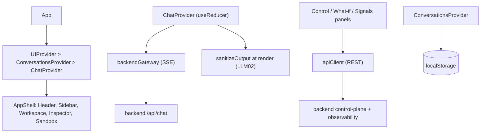

- State is split by rate-of-change (ChatState/Status/Requests/History) so
  streaming re-renders only the message list, not the inspector/panels.

---

## 11. Deployment topology (docker-compose / k8s)

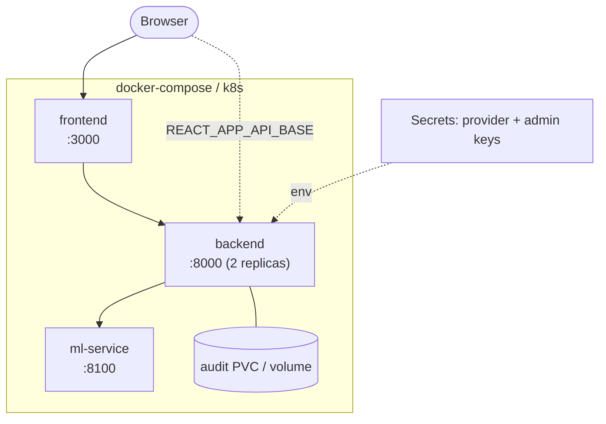

- Backend/ml-service are stateless on the request path (scale horizontally);
  in-process state (limits, trust, session, cache, in-mem audit) is per-replica →
  move to Redis for multi-replica coherence (interfaces are swap-shaped).
